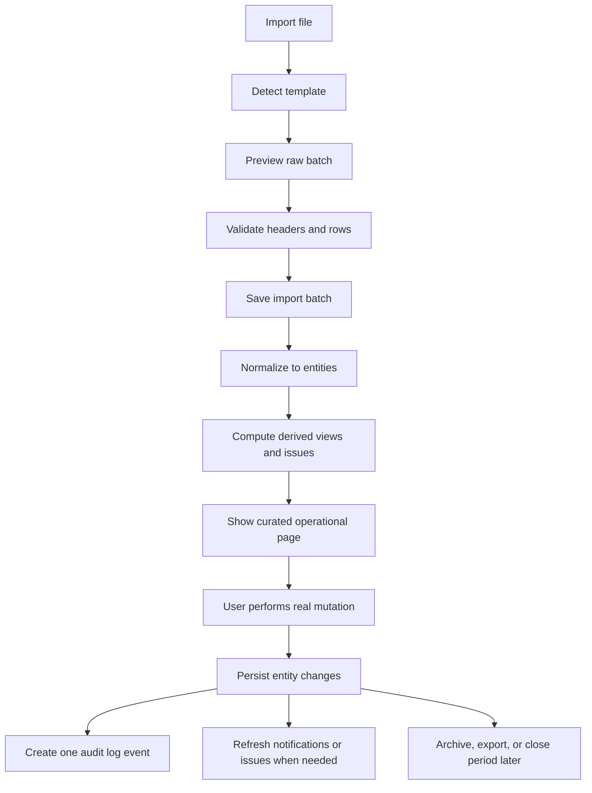

# Reference UI And Sheet Workflow Analysis

Date: 2026-07-14
Scope: Prompt 8.4 planning references only

## Source references reviewed

- Current live portal captures in `.codex-artifacts/`
- User-provided Keeta organizational selector screenshot
- Current shell and module code in:
  - `keeta_operations_portal_ui_redesign.js`
  - `src/ui/sidebarRouting.js`
  - `keeta_operations_portal_operations_extension.js`
  - `keeta_operations_portal_hr_extension.js`
  - `keeta_operations_portal_fleet_extension.js`
  - `keeta_operations_portal_performance_extension.js`
  - `keeta_operations_portal_monthly_rules_extension.js`
- Workbook and import-analysis references:
  - `HR_WORKBOOK_ANALYSIS.md`
  - `PERFORMANCE_TEMPLATE_REFERENCE_NOTES.md`
  - `VDA_TEMPLATE_REFERENCE_NOTES.md`
  - `SHIFT_SCHEDULER_REFERENCE_NOTES.md`
  - `INVOICE_TEMPLATE_REFERENCE_NOTES.md`

## What the Keeta reference should influence

The screenshot is useful as an operational-density reference, not as a literal theme to copy.

The strongest reusable ideas are:

- The sidebar is reserved for modules, not city or register selection.
- The organization context belongs in the header and opens through a dedicated selector.
- Filters sit close to the working table, not inside a marketing-style hero.
- Row-level actions are accessible without leaving the operational list.
- Dense tables and compact filters are acceptable when the page is clearly transactional.

## What the current portal already does correctly

- The shell already has module grouping and subpage routing.
- The organization selector concept already exists and should stay in the top area.
- Drawer-based detail interaction already exists in operations and fleet.
- Layering, runtime containment, and page-scoped loading were already stabilized in Prompt 8.2 and 8.3.
- Import template registration already exists and should remain the source of truth for file understanding.

## What should not be carried forward as-is

- Oversized dashboard hero sections that consume too much height.
- Mixed topbar behavior where runtime metadata, global actions, and page actions compete for space.
- Pages that visually resemble one long export sheet instead of a purpose-built workflow.
- Repeating action buttons in multiple places for the same page intent.
- Exposing raw spreadsheet structure directly as the final user view.

## Operational interpretation of the spreadsheet sources

The spreadsheets are the operational origin of the data, but not the target UI shape.

The sheet patterns imply four separate layers:

1. Raw input layer
   - Imported files preserve original rows, headers, aliases, and warnings.
   - This layer is reviewed inside Import Center, not across every business page.

2. Normalized entity layer
   - Riders, dashboard users, vehicles, performance rows, invoices, and rule records become stable entities.
   - This layer should be the only layer consumed by business pages.

3. Derived operational layer
   - KPIs, issues, validity status, assignment gaps, monthly eligibility, and compliance warnings are computed views.
   - This layer must be cached and invalidated intentionally.

4. Action layer
   - Assign, swap, terminate, approve, import, reconcile, and archive actions update entities and create one valid audit event per mutation.

## Mapping spreadsheet behavior into application behavior

### HR workbook behavior

The HR workbook behaves like a mixed master-data source with archive history, document tracking, and platform-account support.

Application interpretation:

- `HR Master` becomes the canonical curated page.
- Archive and expired-document views become filtered derived views, not separate raw-sheet clones.
- Platform-account and identity support stay linked to riders, not floating spreadsheet tabs in the UI.

### Dashboard users and operations behavior

The operational sheets describe a life cycle, not just a list.

Application interpretation:

- Dashboard users are a controlled registry.
- Working users and working riders are filtered views of assignment and activity state.
- First assignment, swap, status review, and termination are mutations with explicit guardrails.
- Operations Log remains a read-only business audit view.

### Performance and validity behavior

The performance sheets contain wide, repetitive, day-level operational detail.

Application interpretation:

- Summary pages should show KPI cards, status segments, exceptions, and ranked tables first.
- Day-level matrices belong in drilldown drawers or expandable detail views.
- Validity, VDA, face verification, and delivery experience should produce issue-based monitoring views, not only raw report dumps.

### Shift scheduling behavior

Shift files are planning tools with formula-heavy balancing logic.

Application interpretation:

- The future scheduler must show allocation results, uncovered riders, and conflict reasons.
- Raw formula grids should remain a reference surface inside scheduler import or debug views only.

### Invoice and settlement behavior

Invoice sheets represent staged reconciliation, not one flat report.

Application interpretation:

- Company invoice import and internal settlement import must remain separate.
- Final pages should show variance, missing links, totals, and required reconciliation actions.
- The raw source documents must stay inspectable from the import batch history.

## Reference workflow that the redesign should respect

## UI principles derived from both references

- The app should feel like an operations console, not a landing page.
- Filters should be visible, small, and close to the table they affect.
- The topbar should expose context and runtime, not become a second page body.
- Every page should have one primary operational question.
- Raw import detail should be traceable, but it should not dominate the daily workflow.
- Spreadsheet complexity should be translated into explainable statuses, issues, and drawers.

## Direct guidance for Prompt 8.5 onward

- Keep the organization selector in the header as a modal or drawer tree.
- Keep the sidebar strictly module and page navigation.
- Introduce a compact page scaffold with:
  - app topbar
  - context bar
  - page header
  - filter bar
  - KPI strip
  - table workspace
  - details drawer
- Treat workbook-inspired content as data logic input, not layout input.
- Preserve import traceability by linking each curated record back to its import batch where applicable.
